# 智能生活记账系统设计与实现

## 1. 系统简介

### 1.1 系统目标

本系统旨在开发一个基于 Java Spring Boot 的个人智能化财务管理平台。系统致力于解决传统记账软件功能单一、多币种管理困难等痛点。通过集成 **AI 大语言模型（LLM）** 与 **实时汇率接口**，实现自然语言记账、智能消费分析、多币种自动换算等核心功能，帮助用户高效管理个人资产。

### 1.2 主要服务对象

- **大学生群体**：需要管理生活费，培养理财习惯。
- **跨国差旅/留学生**：有频繁的多币种消费记录需求。
- **追求高效记账的用户**：偏好通过对话完成记账，而非繁琐的表单录入。

### 1.3 核心功能与应用场景

1. **智能辅助记账**：用户输入“刚才吃饭花了25块”，系统自动识别金额、分类并生成账单。
2. **多币种自动换算**：支持全球主流货币记账，系统自动抓取实时汇率转换为人民币统计，并保留原始金额快照。
3. **智能报表分析**：除了传统的趋势图外，AI 会根据月度收支生成幽默的财务评价与建议。
4. **数据安全保障**：提供 Excel 格式的账单导入导出，以及数据的备份与恢复功能。

------

## 2. 需求分析与功能建模

### 2.1 系统主要用户角色

- **普通用户 (User)**：系统的主要使用者。登录后可进行记账、查看报表、管理自定义分类、设置预算以及备份数据。

### 2.2 用例分析

本系统聚焦于“账务处理”与“智能化服务”。以下是核心业务用例图：

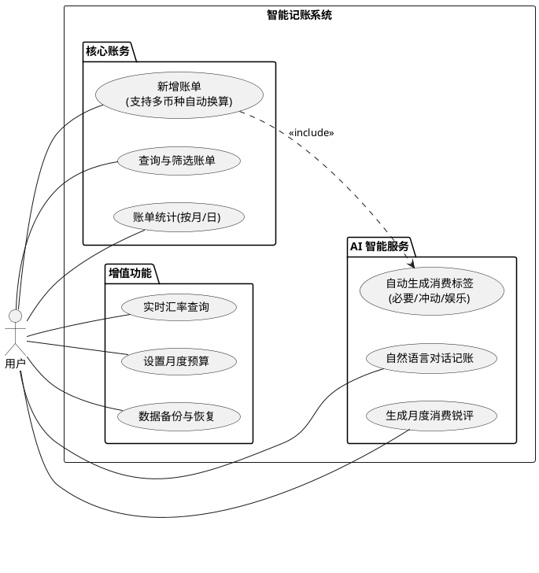

### 2.3 核心功能列表

| 模块         | 功能项  | 详细说明                                |
| ------------ |------|-------------------------------------|
| **账单管理** | 记账录入 | 支持金额、分类、备注、日期录入；支持多币种选择，自动计算汇率。     |
|              | 账单查询 | 支持按时间维度（日/月）、关键词（备注/分类/金额）进行混合检索。   |
| **AI 助手**  | 对话记账 | 能够解析“买咖啡30元”等自然语言，自动提取结构化数据并生成账单。   |
|              | 智能评价 | AI 分析本月 Top3 支出分类，生成个性化的财务分析建议。     |
|              | 情感标签 | 系统自动判断消费性质，打上“必要支出”、“冲动消费”等标签。      |
| **数据中心** | 图表分析 | 展示近 7 天或 30 天的消费趋势折线图及可以显示支出占比的饼状图。 |
|              | 预算监控 | 实时计算本月预算使用情况及剩余百分比。                 |
|              | 数据备份 | 支持将账单导出为 Excel 文件，并支持从备份文件恢复数据。     |

------

## 3. 业务分析与行为建模

### 3.1 核心业务流程图

**业务流程图：**
1. 新增账单：
这是系统最关键的写入流程。系统在保存账单前，需要依次处理“币种换算”和“AI 标签生成”。
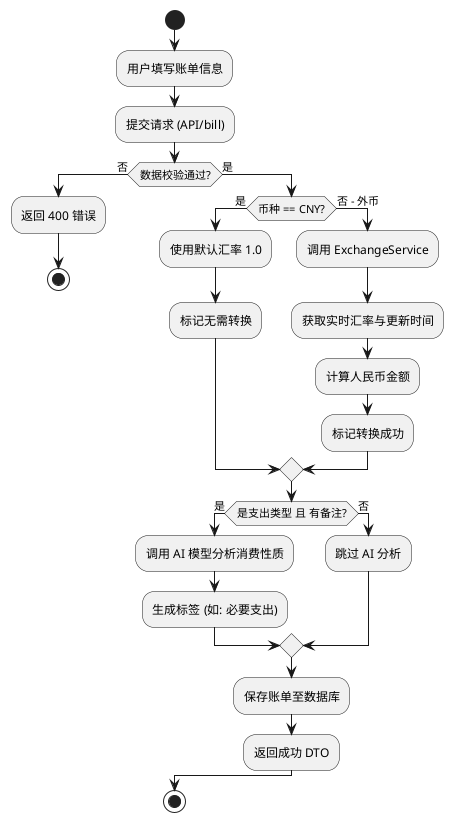
2.AI智能对话： 用户通过聊天界面完成记账的逻辑判断过程

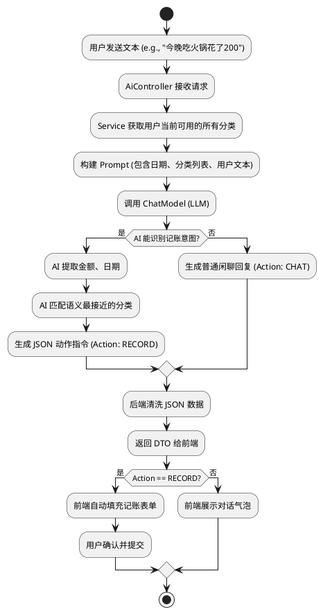

### 3.2 核心业务序列图

**业务序列图：**

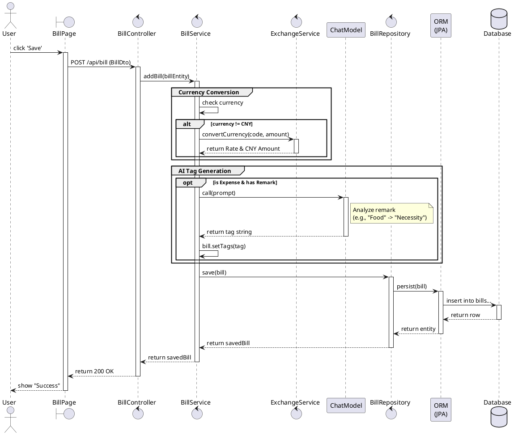

### 3.3 系统静态结构 (类图)

主要展示 User, Bill, Category 等核心实体及其关系。

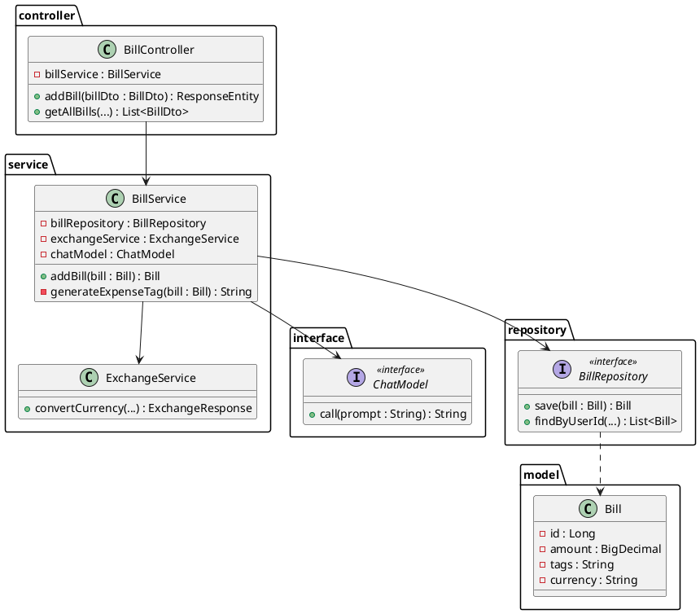

------

## 4. 数据建模

### 4.1 概念数据模型
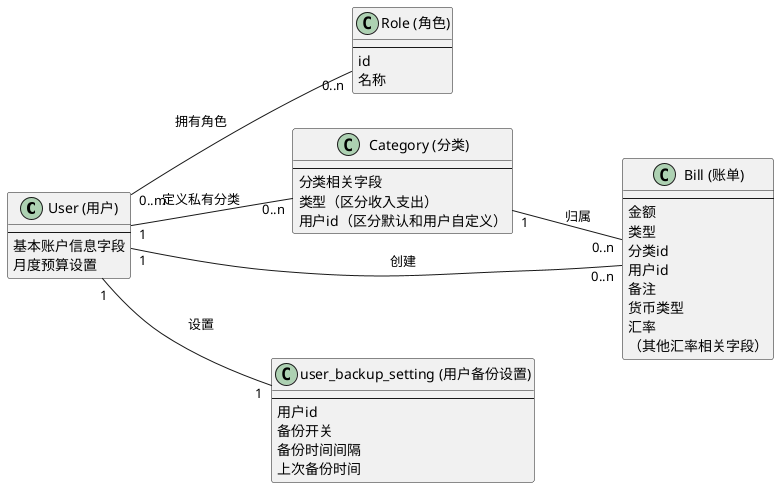

### 4.2 逻辑数据模型
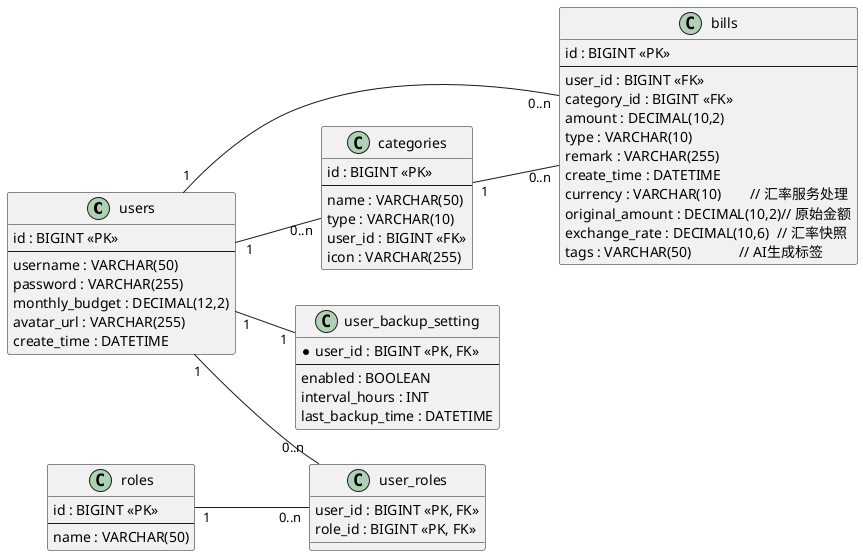

### 系统采用关系型数据库（MySQL）进行存储，核心实体设计如下：

1. **用户 (User)**：核心主体，包含账户信息及月度预算设置。
2. **账单 (Bill)**：核心业务数据，存储金额、币种、汇率快照及 AI 分析结果。
3. **分类 (Category)**：包含系统预设分类（User 为空）及用户自定义分类。
4. **备份设置 (UserBackupSetting)**：存储用户的自动备份策略。

### 4.3 物理表结构设计

#### 4.3.1 Bills (账单表)

| 字段名          | 类型             | 必填  | 说明                     |
| --------------- |----------------|-----| ------------------------ |
| id              | BIGINT         | YES | 主键，自增               |
| user_id         | BIGINT         | YES | 外键，关联 Users 表      |
| category_id     | BIGINT         | YES | 外键，关联 Categories 表 |
| amount          | DECIMAL(10,2)  | YES | 转换后的人民币金额       |
| type            | ENUM           | YES | 枚举：INCOME / EXPENSE   |
| currency        | VARCHAR(10)    | YES | 币种代码 (如 USD, CNY)   |
| original_amount | DECIMAL(12,2)  | NO  | 原始币种金额             |
| exchange_rate   | DECIMAL(18,10) | NO  | 交易时的汇率快照         |
| tags            | VARCHAR(50)    | NO  | AI 自动生成的标签        |
| create_time     | DATETIME       | NO  | 交易发生时间             |

#### 4.3.2 Categories (分类表)

| 字段名  | 类型         | 必填 | 说明                       |
| ------- | ------------ | ---- | -------------------------- |
| id      | BIGINT       | YES  | 主键，自增                 |
| name    | VARCHAR(50)  | YES  | 分类名称                   |
| type    | VARCHAR(10)  | YES  | INCOME / EXPENSE           |
| user_id | BIGINT       | NO   | 若为 NULL 则为系统默认分类 |
| icon    | VARCHAR(255) | NO   | 图标             |

#### 4.3.3 Users (用户表)

| 字段名         | 类型          | 必填 | 说明         |
| -------------- | ------------- | ---- | ------------ |
| id             | BIGINT        | YES  | 主键         |
| username       | VARCHAR(50)   | YES  | 用户名，唯一 |
| password       | VARCHAR(255)  | YES  | 加密后的密码 |
| monthly_budget | DECIMAL(12,2) | NO   | 月度预算限额 |
| avatar_url     | VARCHAR(255)  | NO   | 头像地址     |

#### 4.3.4 UserBackupSetting (用户备份设置表)
| 字段名              | 类型       | 必填  | 说明               |
|------------------|----------|-----|------------------|
| user_id          | BIGINT   | YES | 主键,外键，关联 Users 表 |
| enabled          | TINYINT  | NO  | 是否启用自动备份         |
| interval_hours   | INT      | NO   | 备份时间间隔           |
| last_backup_time | DATATIME | NO  | 上次备份时间           |
| version          | BIGINT   | NO  | 用于用户更新备份设置       |

------

## 5. 界面设计
本项目采用了**响应式网页设计 (Responsive Web Design)** 方案，通过 CSS 媒体查询 (Media Queries) 技术，实现了应用界面在不同屏幕尺寸下的自适应显示（主要是pc和移动端）。
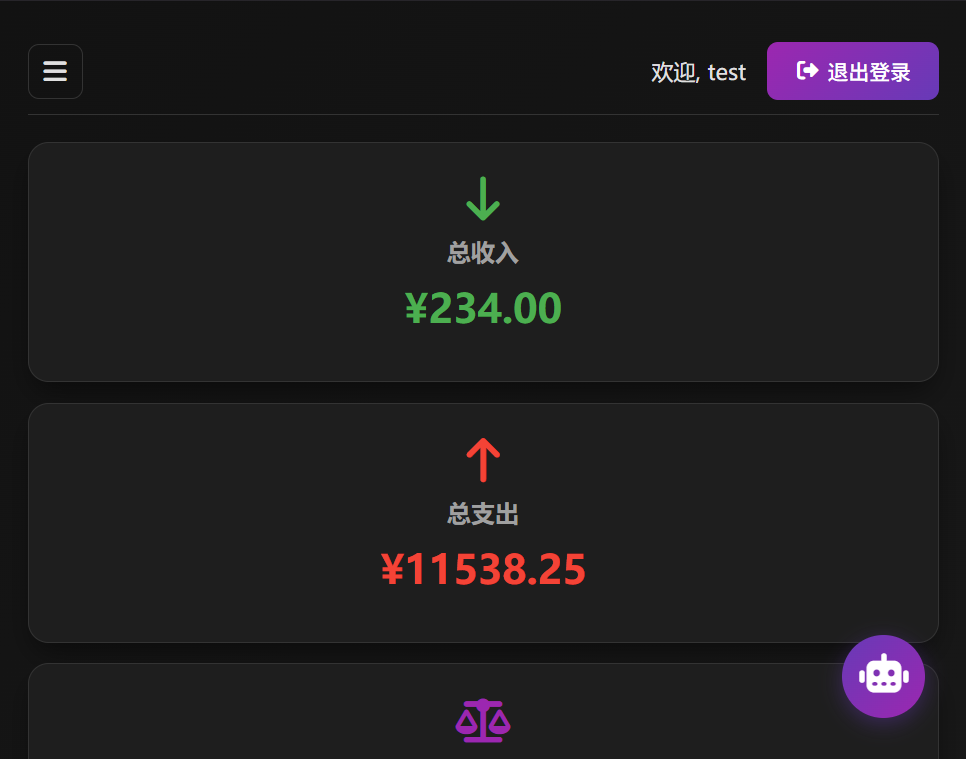   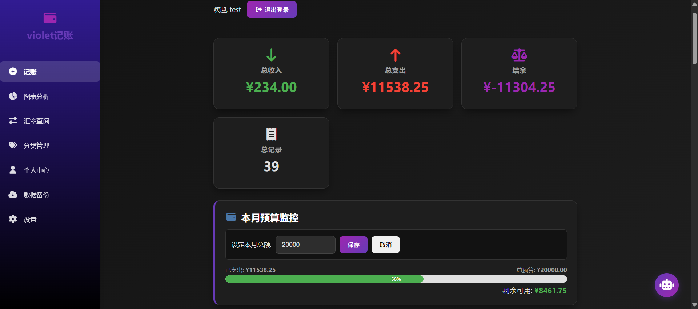

### 5.1 首页仪表盘和预算监控

#### 用户操作流程：
1. 用户登录系统后自动进入此页面。
2. 顶部卡片直观展示本月的总收入、总支出及结余情况。
3. 底部“本月预算监控”区域，用户可点击输入框修改预算金额，点击“保存”后，进度条会实时更新，显示已用比例和剩余可用金额。

#### 对应业务逻辑：
* 数据聚合：后端 BillService 聚合查询当前用户的账单表，计算 totalIncome 和 totalExpense。
* 预算计算：UserService.getBudgetStatus 获取用户设定的 monthlyBudget，结合已支出金额计算百分比（Screenshot 中显示 57%）。

#### 接口交互定义：
| 接口功能            | 请求方式     | 接口路径 | 关键参数   | 响应格式                                                    |  
|-----------------|----------|------|--------|---------------------------------------------------------|
| 获取预算状态        |GET   |/api/user/budget  | 无 (Token中含User ID) | { "limit": 20000, "spent": 11488.25, "percentage": 57 } |
| 设置预算         | POST  | /api/user/budget   | { "amount": 20000 } | string ("预算设置成功")                                                        |

### 5.2  智能记账交互（手动+AI）
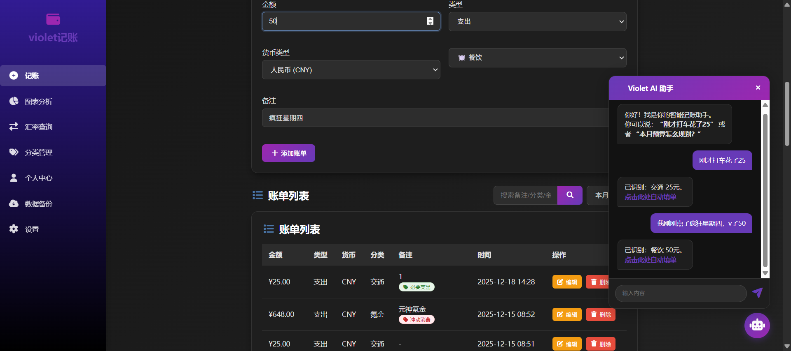
#### 用户操作流程：
* AI 模式：点击右下角机器人图标唤起助手，输入“刚才打车花了25”。
AI 分析后返回识别结果卡片（如“已识别：交通 25元”）。
用户点击卡片上的“点击此处自动填单”，系统自动跳转并填充记账表单。
* 手动模式：用户也可直接填写金额、选择分类。若选择外币（如美元），界面会自动调用汇率接口。

#### 对应业务逻辑：
* 语义解析：AiController 调用 LLM 模型解析自然语言，提取 amount, category, date 等关键信息返回 JSON。
* 智能标签：提交账单时，BillService 会根据备注内容（如“疯狂星期四”），自动打上“冲动消费”或“餐饮”等 Tag 标签（如截图列表所示）。

#### 接口交互定义：
| 接口功能    | 请求方式     | 接口路径         | 关键参数   | 响应格式                                                               |  
|---------|----------|--------------|--------|--------------------------------------------------------------------|
| AI 语义分析 |POST  | /api/ai/chat | { "text": "打车花了25" } | { "action": "RECORD", "data": { "amount": 25, "category": "交通" } } |
| 提交账单    | POST  | /api/bill    | { "amount": 25, "type": "EXPENSE", "remark": "..." } | { "id": 101, "tags": "必要支出", "createTime": "..." }                 |

### 5.3智能图表分析与月度锐评
该模块通过可视化图表展示消费趋势，并引入 AI 扮演“财务分析师”对用户进行个性化点评。
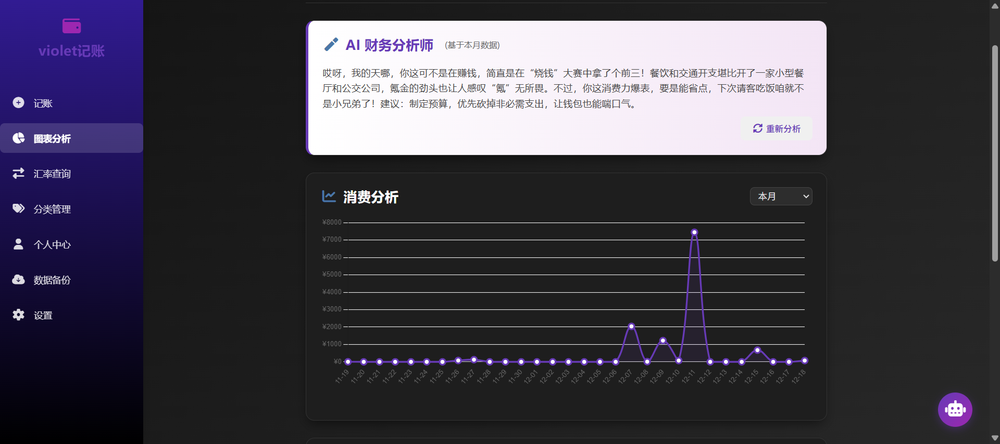  

#### 用户操作流程
1. 点击左侧“图表分析”菜单。
2. 顶部展示 AI 生成的月度评价。
3. 下方展示每日消费折线图，用户可直观看到消费趋势变化。

#### 对应业务逻辑：
* 趋势统计：BillService.getTrendData 统计近 N 天的每日支出总额，若某天无消费则补 0。
* AI 生成评价：AiController.generateMonthlyReport 汇总本月 Top3 支出分类（餐饮、交通、氪金），构建 Prompt 发送给 LLM，生成风格幽默的评价文本。

#### 接口交互定义
| 接口功能    | 请求方式 | 接口路径         | 关键参数   | 响应格式                                                               |  
|---------|-----|--------------|--------|--------------------------------------------------------------------|
| 获取消费趋势 | GET | /api/bill/trend | days=30 | [ { "date": "12-07", "amount": 7500.0 }, ... ] |
| 获取AI评价	  | GET | 	/api/ai/report    | 无 | { "content": "..." }                 |

#### 5.4 实时汇率转换接口
**为满足跨国消费或留学生群体的需求，系统内置了实时汇率换算工具。**
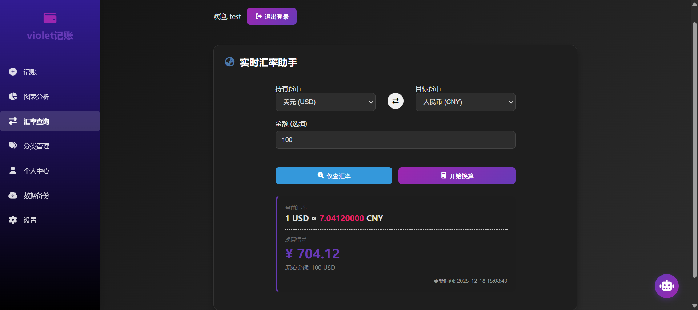

#### 用户操作流程：
1. 点击“汇率查询”菜单。
2. 在“持有货币”和“目标货币”下拉框中选择（如 USD -> CNY）。
3. 输入金额（如 100），点击“开始换算”，系统即时显示换算结果。

#### 对应业务逻辑：
CurrencyController 接收请求后，调用 ExchangeService。
后端通过 WebClient 访问第三方实时汇率 API，获取最新汇率并计算结果返回前端。

#### 接口交互定义： 
| 接口功能    | 请求方式 | 接口路径         | 关键参数                       | 响应格式                                                               |  
|---------|-----|--------------|----------------------------|--------------------------------------------------------------------|
| 货币换算 | GET | /api/currency/convert | from=USD&to=CNY&amount=100 |{ "success": true, "rate": 7.24, "convertedAmount": 724.00 } |

### 5.5 数据安全与备份（含自动备份）
为了防止数据丢失，系统提供了完善的手动/自动备份机制，支持 Excel 格式的数据导出与恢复。
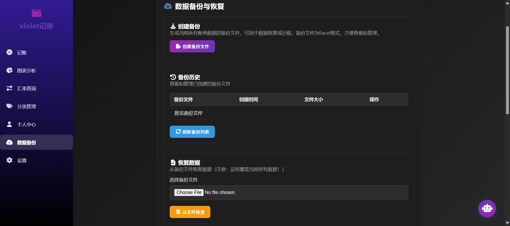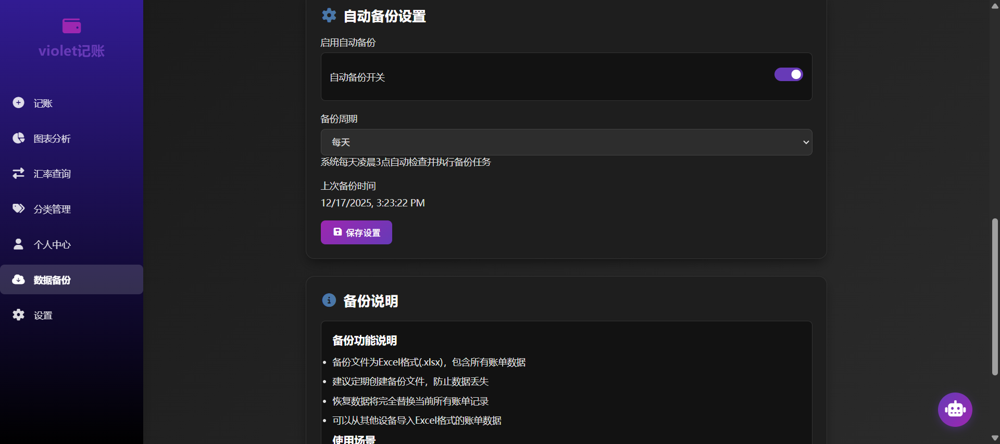

#### 用户操作流程：
* 手动备份：
用户点击“创建备份文件”，系统即时生成包含所有历史账单的 Excel (.xlsx) 文件，并显示在“备份历史”列表中供下载。
*  数据恢复：
用户可上传本地 Excel 文件或选择历史备份，点击“恢复”后，系统将重置当前数据并导入备份内容。
*  自动备份配置：
在“自动备份设置”区域，用户可开启“自动备份开关”。
系统将根据用户设定的策略（如每 24 小时），在后台自动为用户生成备份文件，无需人工干预。

#### 对应业务逻辑：
* 导出/恢复核心：BackupService 利用 Apache POI 库实现 Java 对象与 Excel 单元格的双向解析。恢复操作在 @Transactional 事务中执行，确保“先删后插”过程的数据一致性。
* 自动备份策略：
前端通过 BackupSettingController 获取用户的配置状态（UserBackupSetting 实体）。
后端可通过定时任务（Scheduled Task）扫描开启了自动备份且距上次备份超过 intervalHours 的用户，调用 createBackupForUser 方法自动执行备份逻辑。

#### 接口交互定义：
| 接口功能    | 请求方式 | 接口路径         | 关键参数   | 响应格式                                                               |  
|---------|------|--------------|--------|--------------------------------------------------------------------|
| 创建备份 | POST | /api/backup/create | 无 |string ("备份创建成功: user_1_xxx.xlsx")|
| 恢复备份    | POST | /api/backup/restore    | fileName=xxx.xlsx | string ("恢复成功")                 |
| 获取设置        | GET  | /api/backupsetting/get             |  无                                                    | { "enabled": true, "intervalHours": 24 }                                                                   |
| 更新设置        | POST | /api/backupsetting/update             | { "enabled": true, "intervalHours": 24 }                                                    | string ("设置已保存")                                                                   |

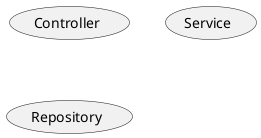